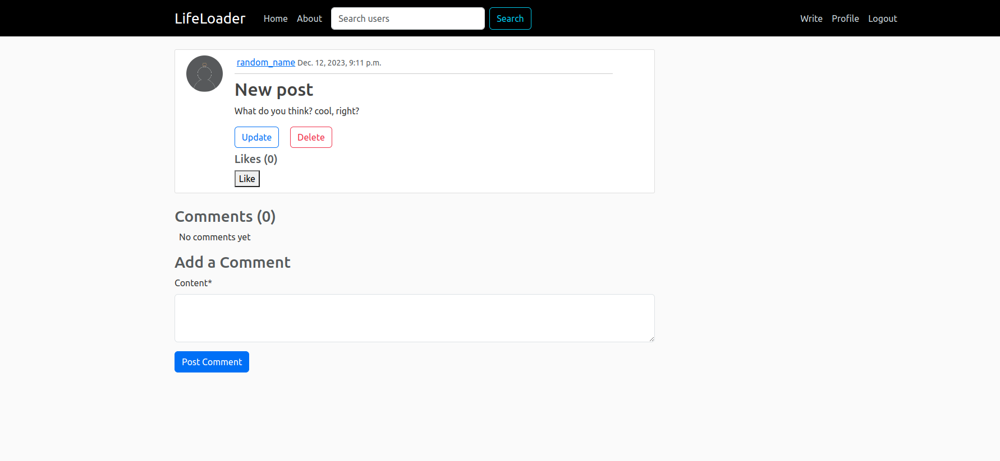
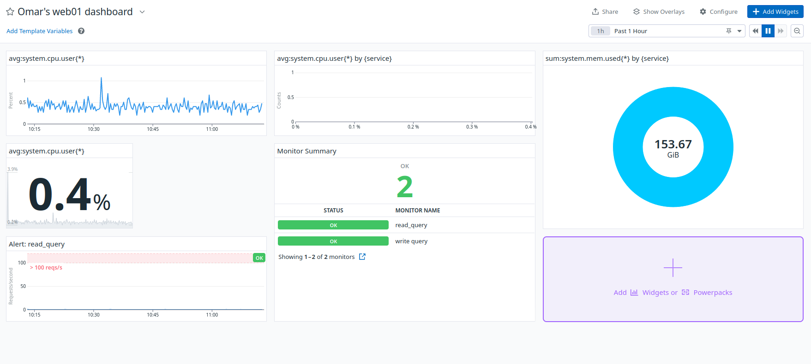

# LifeLoader

**LifeLoader: Loading moments, Sharing lives...**

  *Welcome to LifeLoader, your destination for blogging and social networking. Connect with others, share your thoughts, and explore a vibrant community.*

## Table of Contents

- [Introduction](#introduction)
- [Technologies used](#technologies-used)
- [Features](#features)
- [API Endpoints](#api-endpoints)
- [Demo Video](#demo-video)
- [Installation](#installation)
- [Deployement](#deployement)
- [License](#license)

## Introduction

LifeLoader is an engaging platform where every moment is loaded with shared experiences, share your thoughts, engage in discussions, and build connections, The website is already live, and you can explore it [here](https://lifeloader.omarkhaled.tech/). Please note that the current domain name might not be available in the future, as this project was developed for practice, and the domain may not be renewed. Dive in, explore, and become a part of the LifeLoader community!"

## Technologies used

### Development

- [Django](https://www.djangoproject.com/): The backend is powered by Django, providing a secure and scalable web framework.
- [Bootstrap](https://getbootstrap.com/): Ensuring a responsive and visually appealing user interface.
- [jQuery](https://jquery.com/): Empowering the client to handle dynamic content loading, enhancing frontend interactions, and optimizing server resources.
- [RESTful API](https://en.wikipedia.org/wiki/Representational_state_transfer): Streamlining communication between the frontend and backend for optimal performance.
- [HTML](https://html.spec.whatwg.org/) and [CSS](https://www.w3.org/Style/CSS/Overview.en.html): Crafting the foundation for a pleasing user interface.
- [SQLite](https://www.sqlite.org/): Serving as the database engine in the development environment.

### Deployment

- [PostgreSQL](https://www.postgresql.org/): Providing a robust and scalable database solution for deployment.
- [Apache2](https://httpd.apache.org/): Serving as the web server in the deployment environment.
- [HAproxy](https://www.haproxy.org/): Managing load balancing to distribute incoming traffic efficiently.
- [NFS](https://www.linuxnix.com/nfs-architecture-overview-explained-in-detail/): Facilitating the sharing of media files between servers.
- [Let's Encrypt](https://letsencrypt.org/): Securing the load balancer server with SSL encryption.
- [Datadog](https://www.datadoghq.com/): Utilized for monitoring and analytics in the deployment environment.
- [Linux (Ubuntu)](https://ubuntu.com/): Operating system for the deployment servers.
- [Bash Scripts](https://www.gnu.org/savannah-checkouts/gnu/bash/manual/bash.html): Automating some deployment tasks.

### Version Control

- [Git](https://git-scm.com/) and [GitHub](https://github.com/): Enabling collaborative development and version control.

## Features

### User Authentication

1. **Registration:**
   - Seamless user registration process with a clear and intuitive interface.
   <details>
     <summary>Click to view screenshot</summary>
    
     *Registering process.*
     .
    <summary>Click to view screenshot</summary>
 
     *Account created successfully*
     
   </details>

2. **Login:**
   - Secure login functionality with robust password protection.
   <details>
     <summary>Click to view screenshots</summary>

     *Entering username and password.*
     

     *User successfully logged in, showing the dashboard.*
     
   </details>

3. **Password Reset:**
   - Effortless password reset mechanism for user convenience.
   <details>
     <summary>Click to view screenshot</summary>

     *Request password reset.*
     

     *Email for creating new password has been sent*
     
     
     *Create new password.*
     
   </details>

### Social Networking

1. **Post Creation:**
   - Intuitive interface for creating and publishing posts.
   <details>
     <summary>Click to view screenshot</summary>
    
     *Write Post*
     

     *Published successfully*
     
   </details>

2. **Interaction:**
   - User-friendly features for liking and commenting on posts.
   <details>
     <summary>Click to view screenshot</summary>
     
     *Writing a comment*
     

     *Liking a post*
     
   </details>

3. **Sorting Options:**
   - Explore posts based on latest, top likes, and top comments.
   <details>
     <summary>Click to view screenshot</summary>
     
     *Latest*
     

     *Top Comments*
     
     
     *Top Likes*
     
   </details>


### Profile Management

1. **Update Information:**
   - Easily update profile picture, email, username, and bio.
   <details>
     <summary>Click to view screenshot</summary>

     *The profile before any changes*
     

     *Making Edits*
     
     
     *Profile updated successfully*
     

   </details>

2. **View Others' Profiles:**
   - Explore and view profiles of other users in the community.
   <details>
     <summary>Click to view screenshot</summary>
     
     
   </details>

### Search Functionality

1. **User Search:**
   - Efficient search functionality to find specific users.
   <details>
     <summary>Click to view screenshot</summary>
     
     
   </details>

2. **Posts of a specific user:**
   - Find posts written by a specefic user
   <details>
     <summary>Click to view screenshot</summary>
     
     
   </details>

### Landing Page

- Having a visually good-looking landing page that describes the features of the website.
    <details>
     <summary>Click to view screenshot</summary>
     
     
    </details>

## API Endpoints

These APIs are seamlessly integrated with jQuery, optimizing backend server performance by enabling efficient retrieval of JSON data, which is then presented on the client frontend.

### 1. View Posts Ordered by Latest

- **Endpoint:** `/api/v1/posts/`
- **Description:** Fetches posts ordered by the latest.
- <details>
  <summary>Click to view screenshot</summary>

  
</details>


### 2. View Posts Ordered by Top Likes

- **Endpoint:** `/api/v1/posts/top_likes/`
- **Description:** Fetches posts ordered by top likes.
- <details>
  <summary>Click to view screenshot</summary>

  
</details>

### 3. View Posts Ordered by Top Comments

- **Endpoint:** `/api/v1/posts/top_comments/`
- **Description:** Fetches posts ordered by top comments.
- <details>
  <summary>Click to view screenshot</summary>

  
</details>

### 4. View Comments on a Specific Post

- **Endpoint:** `/api/v1/posts/{post_id}/comments/`
- **Description:** Fetches comments on a specific post.
- <details>
  <summary>Click to view screenshot</summary>

  
</details>

### 5. View Likes on a Specific Post

- **Endpoint:** `/api/v1/posts/{post_id}/likes/`
- **Description:** Fetches likes on a specific post.
- <details>
  <summary>Click to view screenshot</summary>

  
</details>

### 6. Fetch Data of All Users Profiles

- **Endpoint:** `/api/v1/users/`
- **Description:** Fetches data of all user profiles.
- <details>
  <summary>Click to view screenshot</summary>

  
</details>

### 7. View a Specific User Profile

- **Endpoint:** `/api/v1/users/{user_id}/`
- **Description:** Fetches data of a specific user profile.
- <details>
  <summary>Click to view screenshot</summary>

  
</details>

### 8. Post Comment on a Specific Post (if logged in)

- **Endpoint:** `/api/v1/posts/{post_id}/comments/`
- **Description:** Allows the user to post a comment on a specific post (requires authentication).
- <details>
  <summary>Click to view screenshot</summary>

  *Adding a comment*
  

  *Added successfully*
    
</details>

## Demo Video

Check out the demo video to see the features in action:

[](demo_video/LifeLoader_demo.mp4)

Click on the image above to watch the demo video.

## Installation

Follow these steps to get your project up and running.

### Prerequisites

Before you begin, make sure you have the following installed:

- [Python](https://www.python.org/) (version 3)
- [Pip](https://pip.pypa.io/en/stable/installation/) (Python package installer)

### Clone the Repository

```bash
git clone https://github.com/your-username/your-project.git
```

### Navigate to the Project Directory

```bash
git clone https://github.com/your-username/your-project.git
```

### Create a Virtual Environment (Optional but recommended)

```bash
python -m venv venv
```

### Activate the Virtual Environment

- On Windows:
  
  ```bash
   venv\Scripts\activate
  ```

- On macOS/Linux:
  
  ```bash
  source venv/bin/activate
  ```

### Apply migrations

```bash
python manage.py migrate
```

### Create a Superuser (Optional but recommended)

```bash
python manage.py createsuperuser
```

### Run the Development Server

```bash
python manage.py runserver
```

Visit http://localhost:8000/ in your browser to see the application.

## Deployement

### Design overview

For the deployment architecture, I employed a robust 3-server web infrastructure. The infrastructure comprises one server designated as a load balancer, powered by HAProxy, while the other two servers host the website utilizing the Apache web server. Additionally, a master-slave configuration was implemented with two PostgreSQL databases to ensure optimal data management and redundancy.

<details>
  <summary>click here to view the design</summary>

  
</details>

### Deployement steps

#### 1. Download and Install LifeLoader

- **Automated Script:** Run the provided bash script to streamline the installation process. Navigate to the "deploy" directory and execute:

  ```bash
  ./deploy/scripts/installing_LifeLoader.sh
  ```

- Manual Installation: If you encounter issues with the script or prefer a manual approach, follow these steps:
  - Clone the repository to your desired server.
  - Intsall any prerequisites an mentioned in the installation steps above
  - Install the dependencies listed in requirements.txt.
  Adjust configurations as necessary.

#### 2. Adjust Static Settings

- Automated Script: Utilize the provided script for configuring static settings:

  ``` bash
  ./deploy/scripts/adjust_static_settings.sh
  ```

- Manual Configuration: In case of script issues or if you prefer manual adjustments:
    -- Update ALLOWED_HOSTS and add STATIC_ROOT to settings.py (Refer to the script to see how can this be done)
    -- Execute python3 manage.py collectstatic.

#### 3. Install apache2

- Automated Configuration: Run the provided script to automatically set up Apache2 for LifeLoader:

  ``` bash
  ./deploy/scripts/apache2_setup.sh
  ```

- Manual Configuration: If you encounter issues with the script or prefer a manual approach, follow these steps:

  - Install Apache2 and the WSGI module:

    ``` bash
    sudo apt-get install apache2 -y
    sudo apt-get install libapache2-mod-wsgi-py3 -y
    ```

  - Copy the default Apache configuration file to create one for LifeLoader:

    ``` bash
    sudo cp /etc/apache2/sites-available/000-default.conf /etc/apache2/sites-available/LifeLoader.conf
    ```

  - Add the following configurations to LifeLoader.conf, just above the \</VirtualHost> tag. Adjust the paths to match your machine:

    ```bash
            Alias /static /home/ubuntu/LifeLoader/static
            <Directory /home/ubuntu/LifeLoader/static>
                    Require all granted
            </Directory>

            Alias /media /home/ubuntu/LifeLoader/media
            <Directory /home/ubuntu/LifeLoader/media>
                    Require all granted
            </Directory>

            <Directory /home/ubuntu/LifeLoader/LifeLoader>
                    <Files wsgi.py>
                            Require all granted
                    </Files>
            </Directory>

            WSGIScriptAlias / /home/ubuntu/LifeLoader/LifeLoader/wsgi.py
            WSGIDaemonProcess LifeLoader_app python-path=/home/ubuntu/LifeLoader python-home=/home/ubuntu/LifeLoader/venv
            WSGIProcessGroup LifeLoader_app
    ```

  - Ensure the adjustments in paths reflect those on your machine. Finally, enable the LifeLoader website:

    ```bash
    sudo a2ensite LifeLoader
    sudo a2dissite 000-default.conf
    ```

#### 4. Setup postgresql on master server

- Install PostgreSQL and psycopg2:

  ```bash
    sudo apt-get install postgresql postgresql-contrib
    pip3 install psycopg2-binary
  ```

- Access the PostgreSQL command-line interface:
  
  ```bash
    sudo -u postgres psql
  ```

- Execute the following SQL commands, replacing placeholders with your actual information:

  ```sql
  CREATE DATABASE "$your_db";
  CREATE USER "$your_user" REPLICATION LOGIN CONNECTION LIMIT 1 ENCRYPTED PASSWORD "$your_dbpassword";
  ALTER ROLE "$your_user" SET client_encoding TO 'utf8';
  ALTER ROLE "$your_user" SET default_transaction_isolation TO 'read committed';
  ALTER ROLE "$your_user" SET timezone TO 'UTC';
  GRANT ALL PRIVILEGES ON DATABASE "$your_db" TO "$your_user";
  ```

  - For single-server deployment, use this line instead:

    ```sql
    CREATE USER "$your_user" WITH PASSWORD '"$your_dbpassword"';
    ```

- If deploying on two servers (Master-Slave Database Replication), add these configurations:

  ```sql
  ALTER ROLE <your_user> CONNECTION LIMIT -1;
  ```

- Append the following lines to '/etc/postgresql/\<version>/main/postgresql.conf':

  ``` bash
  listen_addresses = '*'
  wal_level = replica
  max_wal_senders = 10
  wal_keep_segments = 64
  ```

- Append the following line to '/etc/postgresql/\<version>/main/pg_hba.conf':

  ```bash
    host    replication     <your_user>   <ip of the slave server>/0   md5
  ```

- Restart the PostgreSQL service:

  ```bash
  sudo service postgresql restart
  sudo service postgresql status
  ```

#### 5. Setup postgresql on slave server

- Install PostgreSQL (as done on the master server) and stop the PostgreSQL server:

  ```bash
  sudo service postgresql stop
  sudo service postgresql status
  ```

- Append the following lines to '/etc/postgresql/\<version>/main/postgresql.conf':

  ```bash
  listen_addresses = 'localhost,<slave server ip>'
  wal_level = replica
  max_wal_senders = 10
  wal_keep_segments = 64
  hot_standby = on
  ```

- Append the following line to '/etc/postgresql/\<version>/main/pg_hba.conf':

  ```bash
  host    replication     <your_user>     <master server ip>/0   md5
  ```

- Delete all PostgreSQL data directory contents (backup important data first, if necessary):

  ```bash
  cd /var/lib/postgresql/<version>/main/
  sudo rm -rfv *
  ```

- Copy data from the master database to the slave database:

  ```bash
  sudo su postgres
  pg_basebackup -h <main server ip> -U <your user> -p 5432 -D /var/lib/postgresql/<version>/main/  -Fp -Xs -P -R
  ```

Enter the PostgreSQL user password when prompted.

- Start the PostgreSQL server:

  ```bash
  sudo service postgresql start
  sudo service postgresql status
  ```

#### 6. Create a configuration file to hide sensitive information

Create a Configuration File for Sensitive Information

- Automated Configuration:
Run the provided script to generate a configuration file with sensitive information:

  ```bash
  ./deploy/scripts/config_file.sh
  ```

Ensure to fill the variables with your actual data. If you encounter issues with the script, you can manually create the file and populate it similarly.

Note: It's advisable to change the secret key on your deployment server. Utilize get_random_secret_key() from django.core.management.utils to achieve this.

#### 7. Update settings

The settings.py files on both the master and slave servers need to be updated. Additionally, a routers.py file must be added to the slave server to facilitate forwarding write operations to the main server, considering the slave server database is read-only.

Find the updated code in:

- For the Master Server: ./deploy/code_changes/master
- For the Slave Server: ./deploy/code_changes/slave

Ensure to incorporate these changes to ensure the proper functioning of the LifeLoader application in your multi-server deployment setup.

#### 8. File permissons

run the script:

```bash
./deploy/scripts/permissions.sh
```

to ensure that the files have the proper permissions

#### 9. Set up NFS for media files

- Install NFS Server on Master:

  ```bash
  sudo apt-get update
  sudo apt-get install nfs-kernel-server
  ```

- Configure Exports on Master:
  
  Update /etc/exports to export your media directory.

  ```bash
  /path/to/media  slave_ip(rw,sync,no_subtree_check)
  ```

- Install NFS Client on Slave:

  ```bash
  sudo apt-get update
  sudo apt-get install nfs-common
  ```

- Mount Media Directory on Slave:

  ```bash
  sudo mount master_ip:/path/to/media /path/to/local/media
  ```

#### 10. Restart apache2 on  both servers

```bash
sudo service apache2 restart
```

### Adjust Load-balancer

- Install HAProxy:
  
  ```bash
  sudo apt-get install haproxy -y
  ```

- Install SSL Certificate using Let's Encrypt:
  
  ```bash
  sudo apt-get install certbot -y
  sudo certbot certonly --standalone -d yourdomain.com
  ```

- Combine Certificate Files

  Combine the Let's Encrypt certificate files into a single .pem file:
  
  ```bash
  sudo cat /etc/letsencrypt/live/yourdomain.com/fullchain.pem /etc/letsencrypt/live/yourdomain.com/privkey.pem > /path/to/your/domain/combined.pem
  ```

- Adjust Load Balancer Configuration:

  Find the HAProxy configuration file at ./deploy/load-balancer/haproxy.cfg. Adjust the settings within this file with your actual paths and server ips

- Start HAProxy:

  ```bash
  sudo service haproxy start
  ```

### Monitoring

Datadog was used for monitoring

<details>
  <summary>Click to view screenshot</summary>

  
</details>

### License

This project is licensed under the MIT - see the LICENSE file for details.
